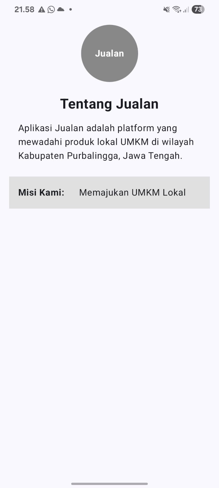
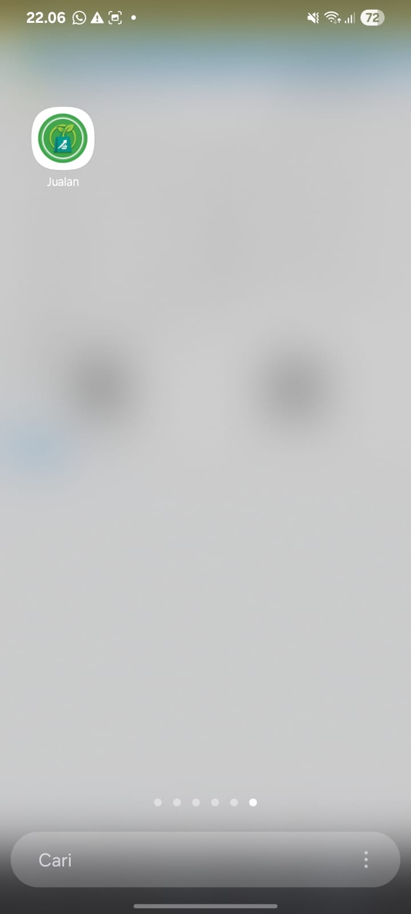
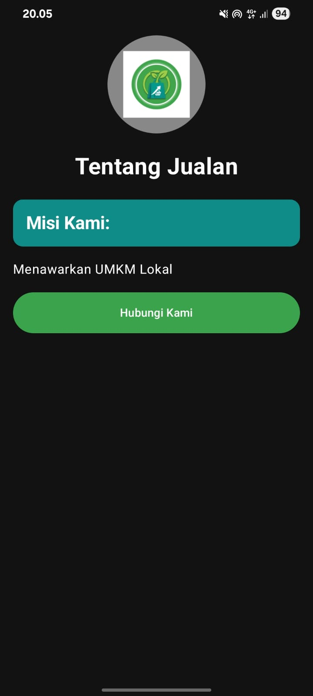
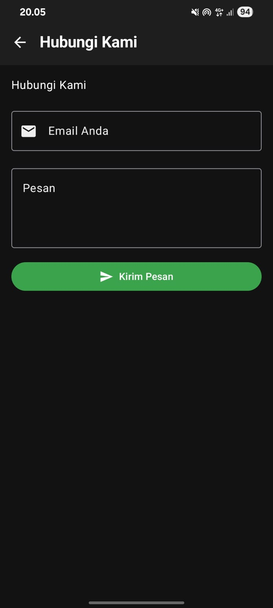
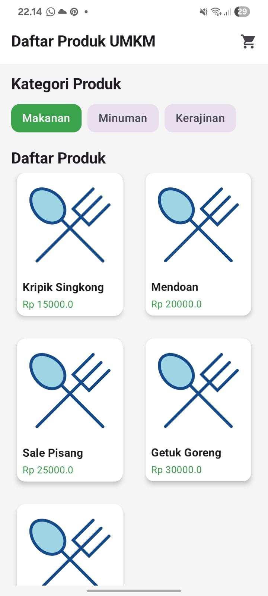

# Laporan Praktikum Pemrograman Mobile

**Nama** : Alifvia Putri Dewani  
**NIM** : H1D024131  
**Shift** : Awal B / Akhir E  
**Praktikum** : Pemrograman Mobile

---

## 📝 Tugas Pertemuan 1
**Tanggal**: Rabu, 2 September 2026

### Hasil Praktikum

**Kesimpulan Praktikum:**  
Pada pertemuan pertama, praktikum memberikan pemahaman dasar mengenai konsep pengembangan aplikasi mobile. Mahasiswa dapat mengenali struktur proyek, alur kerja, serta pentingnya konsistensi dalam penulisan kode agar aplikasi mudah dikembangkan dan dipelihara.

---

## 📝 Tugas Pertemuan 2
**Tanggal**: Rabu, 9 September 2026

### Hasil Praktikum

**Kesimpulan Praktikum:**  
Pertemuan kedua menekankan pada implementasi fitur interaktif dalam aplikasi mobile. Mahasiswa belajar bagaimana menghubungkan antarmuka dengan logika program sehingga aplikasi dapat merespons input pengguna secara dinamis dan memberikan pengalaman yang lebih baik.

---

## 📝 Tugas Pertemuan 3
**Tanggal**: Rabu, 16 September 2026

### Hasil Praktikum

**Kesimpulan Praktikum:**  
Pertemuan ketiga membuka wawasan tentang pengembangan aplikasi mobile yang lebih kompleks. Mahasiswa belajar bagaimana mengintegrasikan berbagai komponen dan fitur untuk menciptakan aplikasi yang lebih lengkap dan bermanfaat.